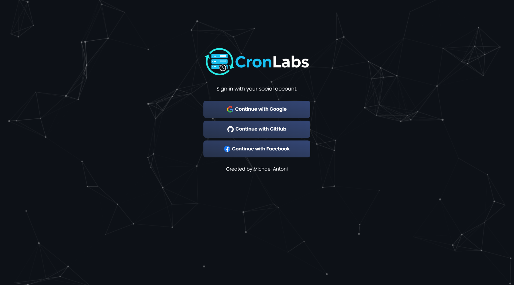

# Cron Labs

Cron Labs is a Next.js web application designed to automate and manage scheduled API requests. It provides a centralized dashboard to ensure your services remain active and execute tasks at precise, customizable intervals.



<br/>

## Tech Stack

| Technology                               | Description                                            |
| :--------------------------------------- | :----------------------------------------------------- |
| Next.js                                  | React framework for web apps.                          |
| TypeScript                               | Typed JavaScript for reliability.                      |
| [Neon](https://neon.com)                 | Serverless Postgres database.                          |
| [Prisma](https://www.prisma.io)          | Type-safe ORM for database management.                 |
| [Auth.js](https://authjs.dev) (NextAuth) | Authentication with OAuth support.                     |
| Bootstrap 4                              | Responsive CSS framework for styling and layout.       |
| [cron-job.org](https://cron-job.org/en/) | External service to trigger and maintain app activity. |
| Nodemailer                               | Node.js module for sending emails and notifications.   |

---

## Features

- **Custom Scheduling:** Effortlessly create cron jobs to trigger API endpoints at any interval—whether it's every 2, 15, or 30 minutes, or once a day.
- **Live Monitoring:** View all active cron jobs and their current status in one dashboard.
- **Detailed Logging:** See the last run time and the next scheduled run for each job.
- **Smart Log Management:** To maintain peak performance, the execution_logs table is automatically pruned every day at 12 AM, keeping your database lean with only the most recent logs.
- **Next.js Uptime Optimization:** Specifically designed to work with `cron-job.org` to prevent serverless functions from idling, ensuring your Next.js app stays "warm" and responsive.

## Getting Started

### Prerequisites

- Node.js 18 or higher
- A Neon Database account
- OAuth credentials (Google, GitHub, or Facebook)
- SMTP server details for email notifications

### Installation

1. **Clone the repository:**

   ```bash
   git clone [https://github.com/m-antoni/cron-labs.git](https://github.com/m-antoni/cron-labs.git)
   cd cron-labs
   ```

1. **Install dependencies:**

   ```bash
   npm install
   ```

1. **Environment Setup** Create a `.env` file in the root directory and add the following:

   ```
   NEXT_PUBLIC_SITE_URL=http://localhost:3000
   NEXTAUTH_URL=
   CRON_SECRET=
   DATABASE_URL=

   AUTH_SECRET=
   AUTH_GOOGLE_ID=
   AUTH_GOOGLE_SECRET=
   AUTH_GITHUB_ID=
   AUTH_GITHUB_SECRET=
   AUTH_FACEBOOK_ID=
   AUTH_FACEBOOK_SECRET=
   AUTH_TRUST_HOST=true

   SMTP_HOST=
   SMTP_PORT=
   SMTP_SECURE=
   SMTP_USER=
   SMTP_PASS=
   CONTACT_RECEIVER=
   ```

1. **Database Migration**

   ```bash
   npx prisma generate
   npx prisma db push
   ```

1. **Run the Development Server**

   ```bash
   npm run dev
   ```

## Author

**Michael B. Antoni**  
LinkedIn: [https://linkedin.com/in/m-antoni](https://linkedin.com/in/m-antoni)  
Email: michaelantoni.tech@gmail.com
